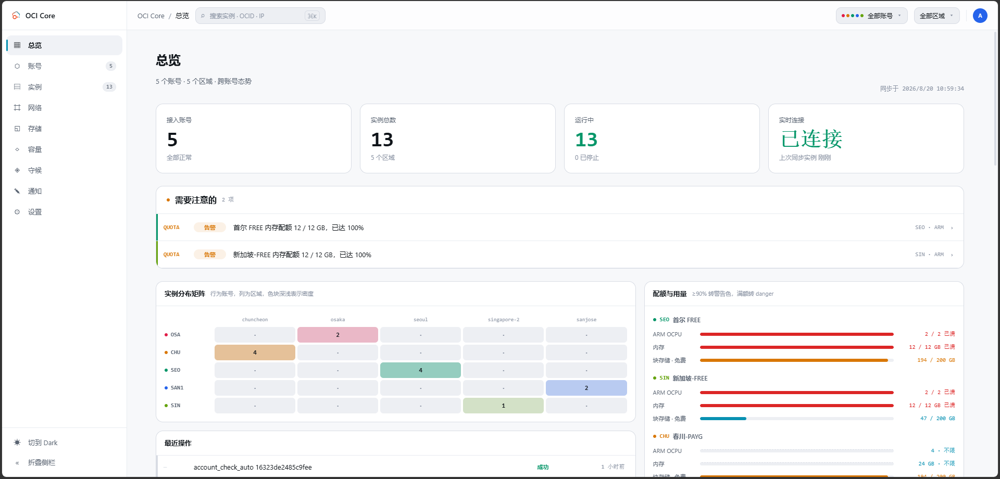
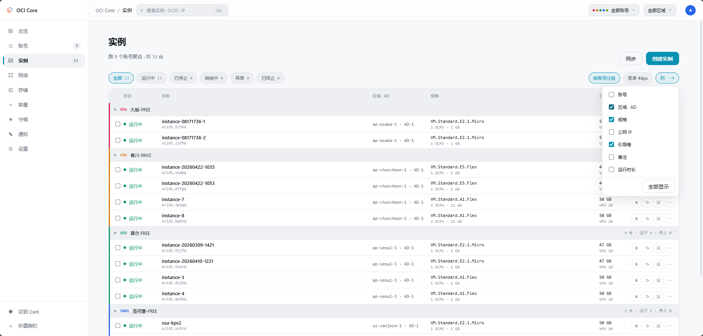
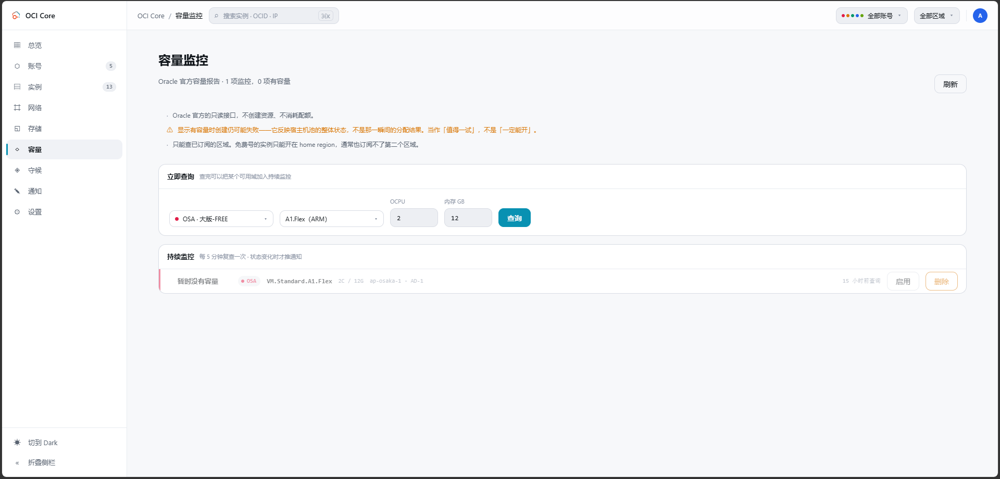
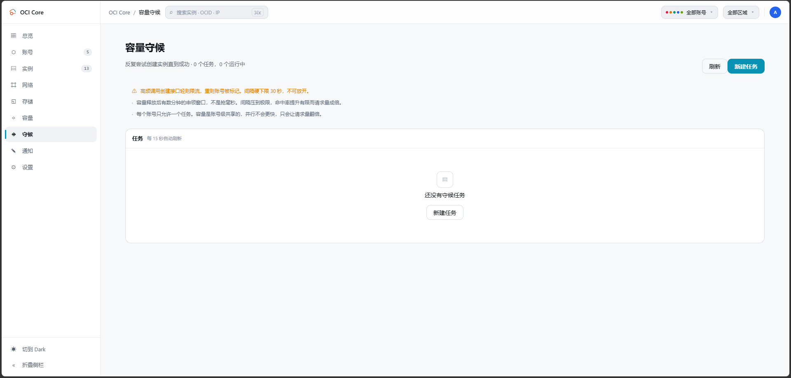
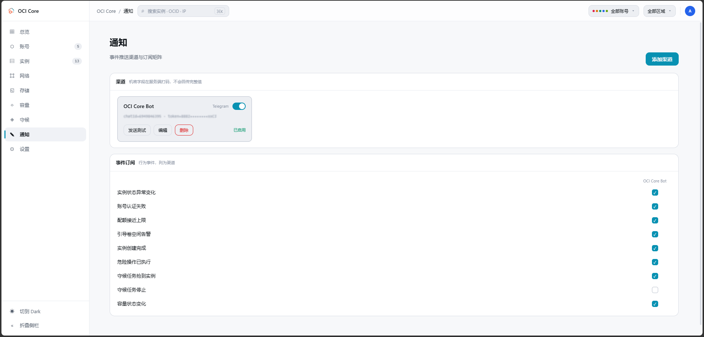
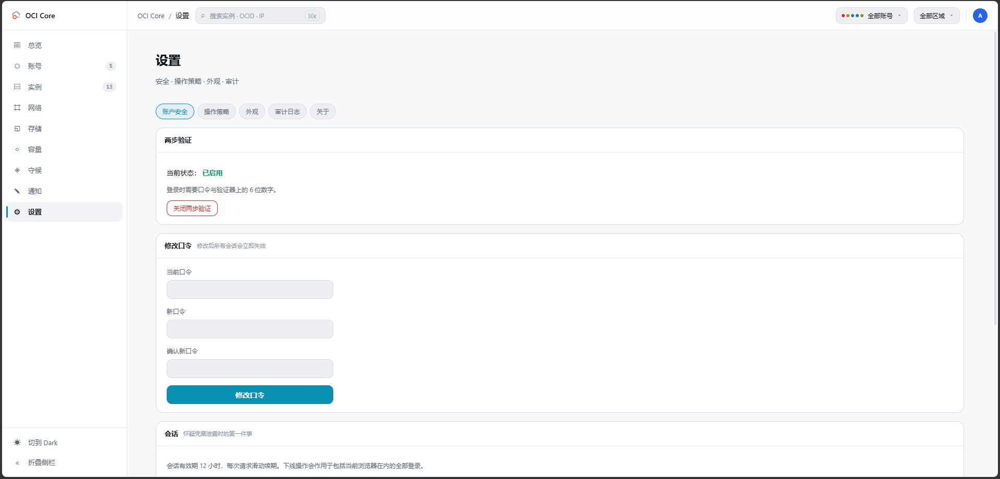

<div align="center">

# OCI Core

**A self-hosted control panel for managing multiple Oracle Cloud accounts**

Brings instances scattered across several Oracle Cloud tenancies into one view,
so you stop switching tenants and regions in the official console.

[](LICENSE)
[](https://go.dev)
[](https://vuejs.org)
[](#docker-deployment)

[简体中文](README.md) · English

</div>



---

## Contents

- [What it is](#what-it-is)
- [Features](#features)
- [Screenshots](#screenshots)
- [Tech stack](#tech-stack)
- [Docker deployment](#docker-deployment)
- [Local development](#local-development)
- [Configuration](#configuration)
- [Security notes](#security-notes)
- [Architecture](#architecture)
- [Known limitations](#known-limitations)
- [Disclaimer](#disclaimer)
- [License](#license)

---

## What it is

A single-binary web panel for managing compute instances across multiple Oracle Cloud accounts.

- **Single-file deployment** — the frontend bundle is embedded via `go:embed`; ~11 MB, statically linked, no runtime dependencies
- **No official SDK** — HTTP Signature is implemented from scratch in ~100 lines, keeping the dependency tree tiny
- **Your data stays local** — SQLite plus the filesystem; nothing is reported to any third party

> **Out of scope**: cost analysis, multi-user RBAC.

---

## Features

| Area | What you get |
|---|---|
| **Accounts** | Multi-tenancy API key onboarding, paste-and-parse OCI config, per-check connectivity validation, account type detection (trial / upgraded), account age, quota lookup, periodic credential re-check, encrypted key storage and rotation |
| **Instances** | Cross-account aggregated list (cached), start / stop / restart, reshape, rename, notes, launch wizard, bulk actions, terminate, list & card views, configurable columns, live status over SSE |
| **Networking** | VCN / subnet / security rule editing, automatic network provisioning, public IP replacement, IPv6 enablement, grouped by account |
| **Storage** | Boot and block volume resize, VPU tuning, attach / detach, including **rescue mode** (detach boot volume → mount on another instance → fix files → reattach) |
| **Capacity monitor** | Calls Oracle's official **read-only** capacity report API to watch when a shape becomes available; notifies on state change |
| **Capacity hunter** | Repeatedly attempts to launch an instance until it succeeds. Checks capacity first by default and skips the round when there is none |
| **Metrics** | CPU / memory / bidirectional traffic time series, resolution adapts to the time span |
| **Console** | Serial console and VNC tunnel connection strings |
| **Notifications** | Telegram / WeCom / DingTalk / Email / Webhook plus an event subscription matrix |
| **Security** | argon2id password hashing, TOTP two-factor, session management with force logout, CSRF protection, login rate limiting, audit log (cursor pagination, full export, optional retention), three-tier confirmation for dangerous actions |

---

## Screenshots

### Instances

One aggregated list across every account. The colored bar and short code on the left
identify which account an instance belongs to; state, shape, boot volume, notes and
uptime all read in a single row. You choose which columns to show — the column picker
is open in the shot below, with the public IP column switched off.



### Capacity monitor

Queries Oracle's official read-only capacity report to see whether a shape has capacity
in each availability domain right now. It creates nothing and consumes no quota, so you
can run it whenever you like.



### Capacity hunter

Retries launching an instance in the background until it succeeds or expires. The page
states the risks up front: a hard 30-second floor on the interval that cannot be raised,
and one task per account. Running tasks show attempt count, the availability domain
currently in rotation, why the last attempt failed, and a countdown to the next one —
the task runs unattended, and without those numbers it is a black box.



### Notifications and settings

| Notification channels | Operation policy |
|---|---|
|  |  |

---

## Tech stack

| Layer | Choice | Notes |
|---|---|---|
| Backend | **Go 1.26** | Standard-library `net/http`, no web framework |
| Database | **SQLite** (`modernc.org/sqlite`) | Pure Go, no CGO, statically linkable |
| OCI access | **Hand-rolled HTTP Signature** | draft-cavage, RSA-SHA256, no official SDK |
| Crypto | **AES-256-GCM** envelope encryption · **argon2id** · **RFC 6238 TOTP** | Private keys encrypted at rest, AAD bound to account ID |
| Frontend | **Vue 3 + TypeScript + Vite** | Composition API, no UI framework, hand-written CSS |
| Realtime | **SSE** | Server-pushed state changes |
| Container | **Docker** (three-stage build) | node → golang → alpine |

---

## Docker deployment

**Recommended.** Requires Docker and Docker Compose.

```bash
git clone https://github.com/jsongmax/oci-core.git
cd oci-core
docker compose up -d --build
```

Open `http://127.0.0.1:8080` and follow the first-run setup and two-factor binding.

The image is built in three stages: frontend (Vite) → backend (static build) → alpine runtime.
The runtime image contains just one executable and a data directory.

### Three things that commonly go wrong

<details>
<summary><b>1. Do not map the port as <code>8080:8080</code></b></summary>

<br>

`docker-compose.yml` binds `127.0.0.1:8080:8080` — **host loopback only**.
This panel holds full control over all of your Oracle tenancies; exposing port 8080
publicly hands the login page to the entire internet. Use one of these instead:

```bash
# SSH tunnel — simplest
ssh -L 8080:127.0.0.1:8080 your-server
```

Or put a TLS reverse proxy in front (Nginx / Caddy / Cloudflare Tunnel).
**Only then** set `OCICORE_TRUST_PROXY=true`. Enabling it without a real proxy lets
anyone bypass the failed-login rate limiter by forging `X-Forwarded-For`.

</details>

<details>
<summary><b>2. Inside a container you must bind <code>0.0.0.0</code></b></summary>

<br>

The program listens on `127.0.0.1` by default, which inside a container means nobody
can reach it. The image already sets `OCICORE_ADDR=0.0.0.0:8080` in `ENV`; don't drop
it if you write your own `docker run`.

This does not expose it publicly — that is decided by `-p`.

</details>

<details>
<summary><b>3. Lose the <code>ocicore_ocicore-data</code> volume and every stored private key becomes undecryptable</b></summary>

<br>

The volume holds `master.key` and the encrypted database. **You need both**:

- Database only → the private keys are ciphertext you cannot decrypt
- Key only → no data

Worse, a missing `master.key` produces **no error**: a fresh random key is generated,
the service starts normally, you can still log in, the account list is still there —
but every account fails the moment you use it, permanently.

Back up the whole data directory:

```bash
# The volume name carries the compose project prefix. Check yours first:
docker volume ls | grep ocicore

docker run --rm -v ocicore_ocicore-data:/data -v "$PWD:/backup" \
  alpine tar czf /backup/ocicore-backup.tar.gz -C /data .
```

Restore by extracting into the same volume. **Treat the backup file itself as a secret.**

</details>

### Upgrading

```bash
docker compose up -d --build
```

Data lives in a named volume; recreating the container leaves it alone.
Database migrations run automatically at startup.

> **Never add `-v`** (`docker compose down -v`) — that deletes the `ocicore_ocicore-data`
> volume along with `master.key` and every encrypted private key.

---

## Local development

Requires **Go 1.26+** and **Node 18+** (the build image uses Node 24).

### Run it

```bash
go run ./cmd/server
```

Listens on `127.0.0.1:8080`, writes to `./data/`, generates a master key on first start.

### Frontend development

```bash
cd web && npm install && npm run dev
```

Dev server runs on `5173` and proxies `/api` to `127.0.0.1:8080`.

You can also have the backend serve the built assets from disk, so frontend changes
don't require rebuilding Go:

```bash
OCICORE_STATIC_DIR=./internal/web/dist go run ./cmd/server
```

### Building a single binary

The frontend bundle is committed, so you can build directly:

```bash
go build -ldflags "-s -w -X main.version=0.1.0" -o dist/ocicore ./cmd/server
```

Rebuild the frontend only if you changed it:

```bash
cd web && npm run build
```

Vite outputs to `internal/web/dist`, which `go:embed` compiles into the binary.
**That path is resolved at compile time, so a missing directory fails the Go build.**

### Tests

```bash
go test ./... && go vet ./...
cd web && npm run typecheck
```

> If your `go env` sets `GOOS=linux` (handy for producing deployment binaries directly),
> override the target platform to run tests on Windows:
>
> ```bash
> GOOS=windows GOARCH=amd64 go test ./...
> ```

---

## Configuration

All via environment variables.

| Variable | Default | Notes |
|---|---|---|
| `OCICORE_ADDR` | `127.0.0.1:8080` | Listen address. **Must be `0.0.0.0:8080` inside a container** |
| `OCICORE_DATA_DIR` | `./data` | Database and master key directory |
| `OCICORE_MASTER_KEY` | empty | Hex master key; falls back to `$DATA_DIR/master.key` |
| `OCICORE_STATIC_DIR` | empty | Frontend asset directory; takes precedence over embedded assets (development) |
| `OCICORE_SESSION_TTL` | `12h` | Session lifetime, sliding renewal |
| `OCICORE_TRUST_PROXY` | `false` | Whether to trust `X-Forwarded-*`. **Only enable behind a real reverse proxy** |

Configurable in the UI as well: background sync interval, credential re-check interval,
audit log retention, dangerous-action policy.

---

## Security notes

This panel holds full control over **all** of your Oracle tenancies.

1. **Create a dedicated IAM user for this tool** with only the compute / vcn / block-storage
   policies it needs. Do not use a key from the Administrators group.
   **This single step matters more than everything else combined.**
   The account detail page has a "permission self-check" tab with copy-pasteable policy examples.
2. **It listens on loopback by default.** Put a TLS reverse proxy in front for remote access.
3. **Back up `master.key`.** It is the only key that decrypts every stored OCI private key.
   Lose it and every account must be re-entered. It must never enter version control
   (already covered by `.gitignore`).
4. **Enable two-factor.** First-run setup walks you through it.
5. Private keys are stored AES-256-GCM encrypted with AAD bound to the account ID.
   **There is no UI path that exports or reveals a private key.**
6. **Complete first-run setup immediately after deploying.** `GET /api/status` is a public
   endpoint (the login page needs it to decide whether initialization is required) and returns
   `setupRequired`. A deployed panel with no administrator yet can be claimed by whoever
   finds it first.
7. **Only enable `OCICORE_TRUST_PROXY` behind a reverse proxy** that overwrites the header
   itself (Nginx: `proxy_set_header X-Forwarded-For $proxy_add_x_forwarded_for;`).
8. The frontend loads no external resources (no CDN, no Google Fonts). CSP is
   `default-src 'self'` — both a hardening measure and the reason the panel works
   on a fully offline network.

---

## Architecture

```
cmd/server          entry point: config, connections, routes, graceful shutdown
internal/
  ociclient         OCI API client: signer, error classification, compute / network / storage / limits / metrics / capacity / console
  ociconn           builds per-account clients (the only place private keys are decrypted)
  cryptobox         private key envelope encryption
  store             SQLite: accounts / users / sessions / instance cache / settings / channels / audit / hunt tasks / capacity watches
  auth              argon2id · TOTP · session tokens
  accountsvc        per-check connectivity validation
  instancesvc       cross-account aggregation, lifecycle orchestration, SSE event bus
  netsvc            network provisioning, IP replacement, IPv6, security rule templates
  huntsvc           capacity hunter scheduler: backoff, AD rotation, duplicate-launch guard
  capacitysvc       capacity monitor polling
  notify            notification channel dispatch
  httpapi           REST layer
  web               embedded frontend assets
web/                frontend source (Vue 3 + TS + Vite)
docs/
  API.md                API reference
  FRONTEND-DESIGN.md    frontend design spec
  CAPACITY-HUNTER.md    capacity hunter design doc
```

<details>
<summary><b>Deliberate trade-offs</b></summary>

<br>

- **Hand-rolled signing instead of the official SDK** — OCI uses draft-cavage HTTP
  Signatures, roughly 100 lines to implement. The payoff is a tiny dependency tree and
  fully controllable error classification. [`internal/ociclient/errors.go`](internal/ociclient/errors.go)
  is the most important table in the project: it decides what is retryable, how long to
  back off, and when an account should be flagged.

- **The instance list is cached** — 8 accounts × 4 regions is 32 API round trips.
  A background job syncs into SQLite; the list reads the cache instantly and state changes
  arrive over SSE. Sync errors are isolated per (account × region), so one broken account
  does not blank the whole list.

- **Optimistic updates stop at the transitional state** — the API returns `STOPPING`,
  never `STOPPED`. The settled state is confirmed by background polling and pushed over SSE.
  Users neither think nothing happened nor get told it is done when it isn't.

- **Dangerous actions are validated server-side** — terminating requires echoing the
  instance name, deleting an account requires echoing its alias, and turning off
  `allowTerminate` returns 403 outright. The confirmation dialogs are UX; these are the defense.

- **SQLite over Postgres** — one machine, one process, a few dozen accounts. Pure Go,
  no CGO, painless cross-compilation.

- **A custom request header for CSRF** — browsers do not allow cross-origin requests to
  carry custom headers (this service never enables CORS), so "has the `X-OCI-Tools` header"
  is equivalent to "came from this site's own scripts". Simpler than double-submit cookies,
  with no token synchronization problem.

- **The capacity hunter checks capacity first by default** — the capacity report is a
  read-only API; `LaunchInstance` is the one Oracle's abuse controls watch. Trading one
  read for one create cuts actual launch requests by an order of magnitude.

- **Account identity colors plus short codes** — the core cognitive load in multi-account
  management is "which account is this instance under". The code is mandatory rather than
  decorative: accessibility requires that color never be the sole carrier of information.

</details>

---

## Known limitations

- TOTP binding provides the secret text and an `otpauth://` link but no QR code
  (avoids pulling in a QR dependency). Choose "enter key manually" in your authenticator.
- Metrics depend on the Oracle Cloud Agent running inside the instance. Without it the
  API returns successfully but the series are empty.
- When the capacity report says capacity is available, **a launch can still fail** — it
  reflects the host pool's overall state, not the allocation outcome at that instant.
- The capacity monitor can only query **subscribed regions**. Always Free accounts can only
  launch in their home region and generally cannot subscribe to a second one.
- Backup and snapshot policies are not implemented.

---

## Disclaimer

**Read this before using the software.**

1. **This project is not affiliated with Oracle Corporation** and is not endorsed,
   sponsored, or supported by Oracle. Oracle, Oracle Cloud, and OCI are trademarks of
   Oracle Corporation.

2. **You are responsible for ensuring your usage complies with Oracle's terms of service.**
   This software only wraps the official API in a nicer interface, but **you** are
   accountable for every request it sends on your behalf. This applies especially to the
   capacity hunter: it repeatedly calls the instance-launch API, and **high-frequency calls
   are something Oracle explicitly discourages**. It may lead to rate limiting, your account
   being flagged, or in extreme cases suspension. The software ships with backoff, a
   frequency floor, and in-app risk warnings, but **the residual risk is yours**.

3. **This software holds your cloud credentials.** Deploy it according to the
   [security notes](#security-notes) — in particular, do not expose the panel directly to
   the public internet, and create a least-privilege dedicated IAM user for it.

4. **No responsibility is taken for data loss.** Losing `master.key` permanently prevents
   decryption of every stored OCI private key. Terminating instances and deleting boot
   volumes are **irreversible**. Keep your own backups.

5. The software is provided "as is" without warranty of any kind. See [LICENSE](LICENSE).

---

## License

[MIT](LICENSE) © 2026 jsongmax
